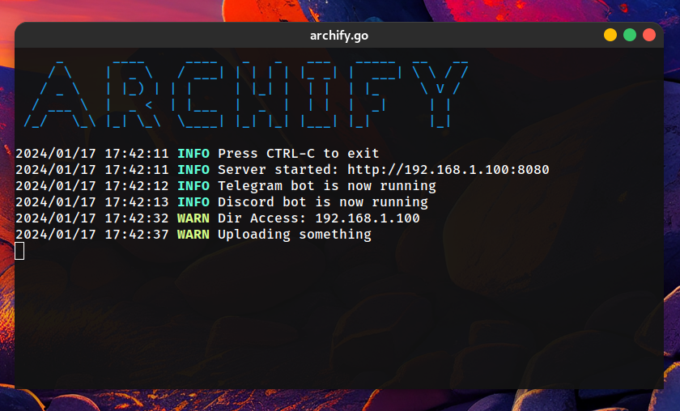
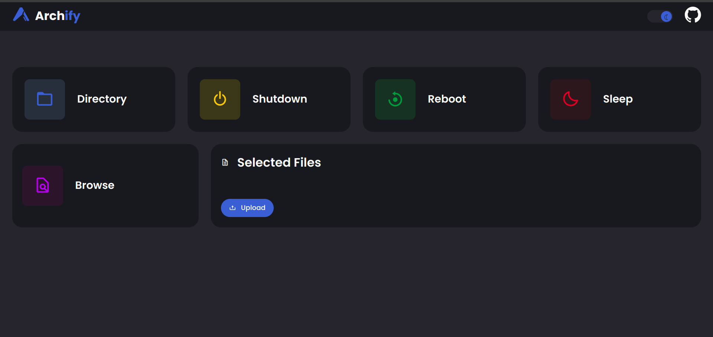
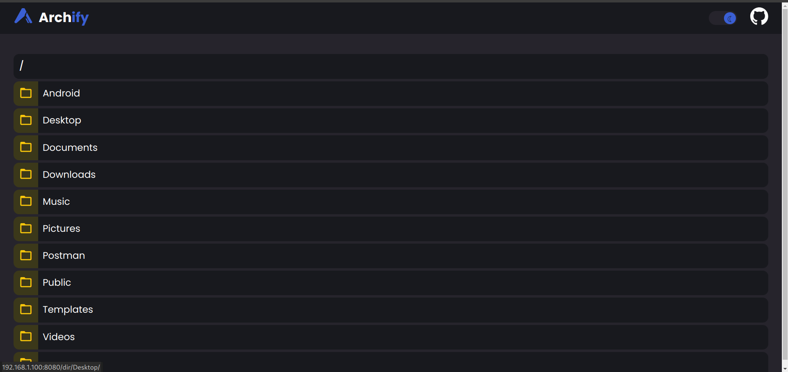

# homeServe
Script that serves my own home directory for my home network

## 🔥 About

My personal homeServer and telegram/discord bot to watch movies on my pc and control it with my phone.




## 🔨 Installation


1. Ensure you have [Go](https://go.dev/dl/) installed.
2. Clone the repo:
 ```sh
git clone https://github.com/archroid/homeServe.git
```

3. export `DISCORD_BOT_TOKEN` & `DISCORD_BOT_TOKEN` .
Also don't forget `Home_path` as the directory you want to serve.

```sh
export  DISCORD_BOT_TOKEN={DISCORD_BOT_TOKEN}

export  TELEGRAM_BOT_TOKEN={TELEGRAM_BOT_TOKEN}

export  HOME_PATH={HOME_PATH}
```

* Alternatively you can create a `.env` file in the project root directory and add the above variables there.

* See [this](https://www.writebots.com/discord-bot-token/) and [this](https://core.telegram.org/bots/tutorial#obtain-your-bot-token) to make a bot and get your tokens.


4. Install dependencies
```sh
go mod tidy
```

5. Run the project
```sh
go run .
```


## 📷 Screenshots



