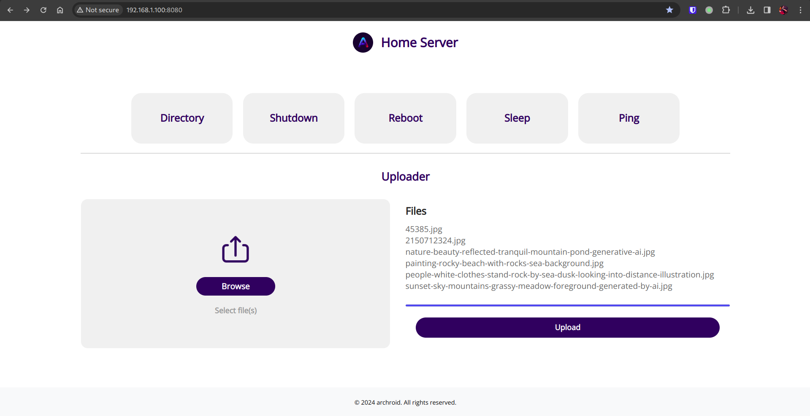
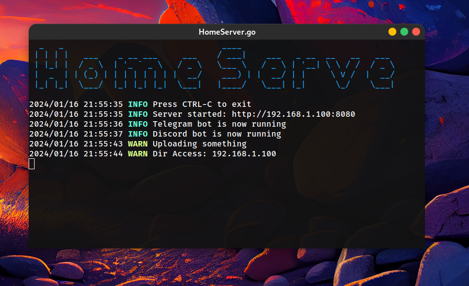

# homeServe
Script that serves my own home directory for my home network

## 🔥 About

My personal homeServer and telegram/discord bot to watch movies on my pc and control it with my phone.




## 🔨 Installation


1. Ensure you have [Go](https://go.dev/dl/) installed.
2. Clone the repo:
 ```sh
git clone https://github.com/archroid/homeServe.git
```

3. export `DISCORD_BOT_TOKEN` & `DISCORD_BOT_TOKEN`.

```sh
export  DISCORD_BOT_TOKEN={DISCORD_BOT_TOKEN}
```

* See [this](https://www.writebots.com/discord-bot-token/) and [this](https://core.telegram.org/bots/tutorial#obtain-your-bot-token) to make a bot and get your token.

* If you don't have the youtube API key, click. [here](https://blog.hubspot.com/website/how-to-get-youtube-api-key) 
 

* See [this](https://docs.mongodb.com/manual/installation/) link to install mongoDb if you don't have it installed.

4. Install dependencies
```sh
go mod tidy
```

5. Run the project
```sh
go run .
```


## 📷 Screenshots


